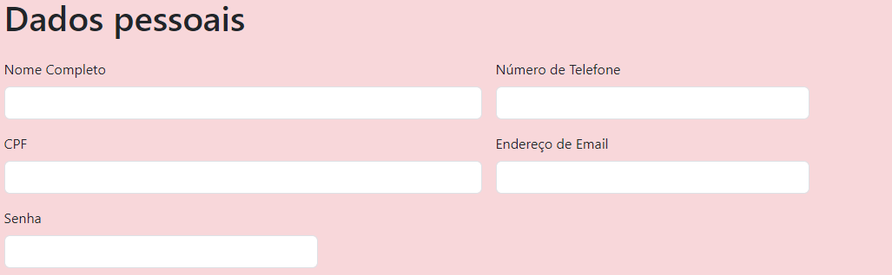
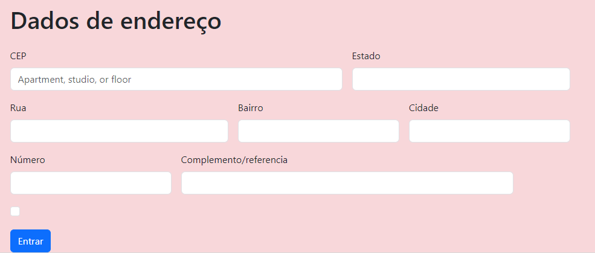

# -form-CadEcommerce
* [Form cadEcommerce](#form-cadEcommerce)
* [Descrição](#descrição)
* [Introdução](#introdução)
* [Sites Consultados](#sites-consultadoss)
* [Tecnologias Utilidades](#tecnologias-utilizadas)
* [Fontes Consultadas](#fontes-consultadas)
* [Autores](#autores)
 
# Formulário Cadastro Ecommerce
 
## Descrição 📖
- Este projeto é um formulário de contato básico em HTML, criado como parte de um exercício de prática. Ele permite que os usuários preencham informações e enviem mensagens através do formulário. É uma ótima maneira de aprender os conceitos básicos de criação de formulários em HTML.
 
## Introdução ✉️
- Preenchimento de dados em um formulário de contatos

 
## Sites Consultados 🧠
- [Shopee](https://shopee.com.br/)
- [Magazine Luiza](https://www.magazineluiza.com.br/)
- [Amazon](https://www.amazon.com.br/)
- [boot strap](https://getbootstrap.com/)

## Funcionalidade
Aprender a construir uma tabela de formulário de contatos em HTML5
 
## Tecnologias Utilizadas 🖥️  
- Visual Studio Code;
- CSS3;
- HTML5;
- Github;
- boot strap
- Git
 
## Autores 👥
- [naillim novaski](https://github.com/naillimnovaski)
- [Murilo Tonassi](https://github.com/murilo-tonassi)
